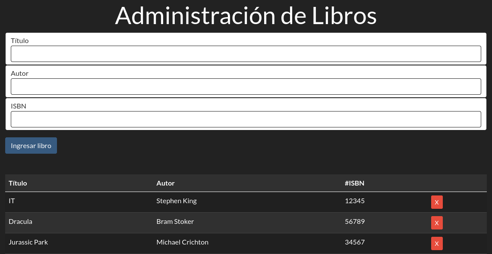

# APP DE  CONTROL DE LIBROS

Aplicación web sencilla que permite agregar y eliminar libros.

## Características

* Permite agregar libros mediante tres datos: título, autor y código ISBN
* Permite eliminar libros
* Muestra la lista de libros
* Se utilizó el localStorage para guardarlos en un array de objetos JSON

# Consideraciones

* HTML5
* Bootstrap 4
* JavaScript
* NodeJS 16.4.0
* npm 7.18.1
* LiteServer 2.6.1

## Capturas

